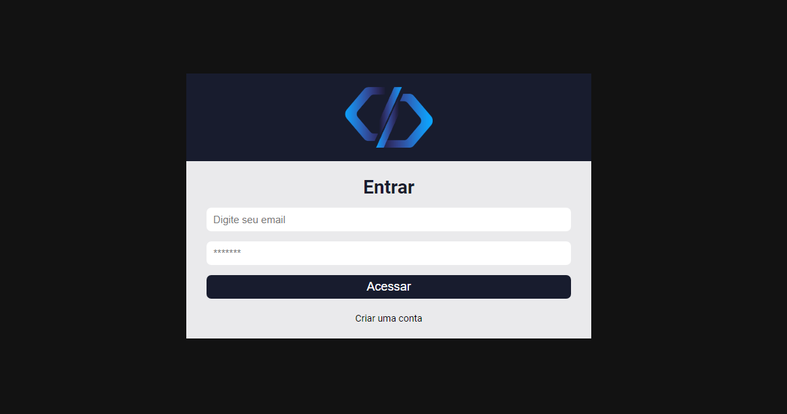
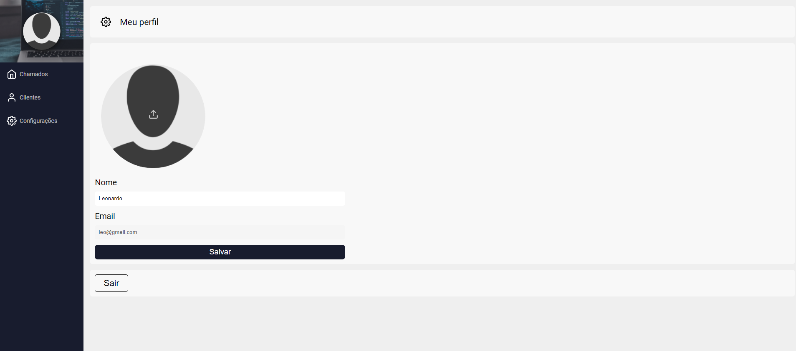
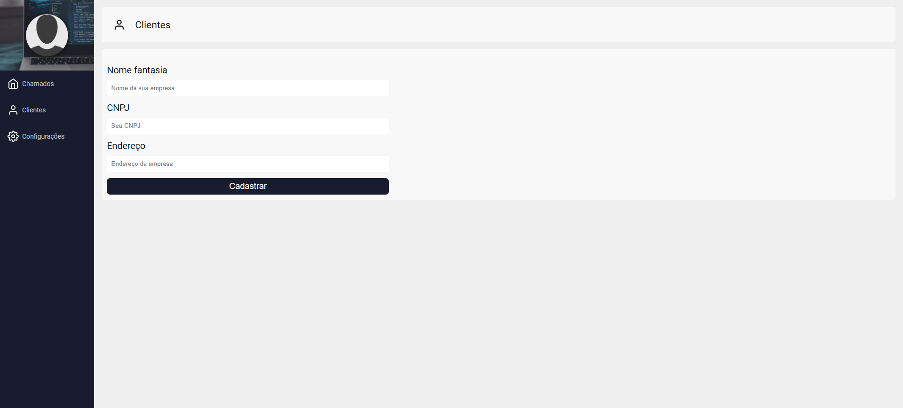
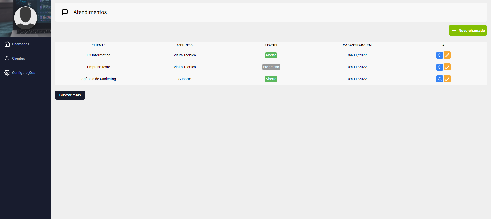
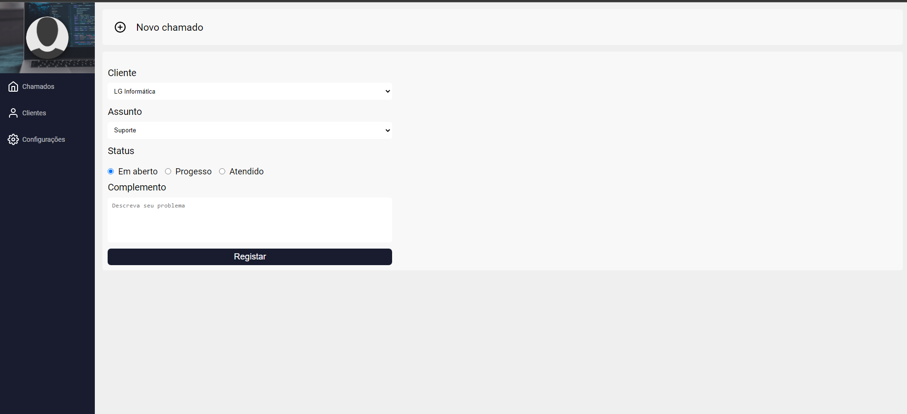

# Sistema de Chamados

# Sobre o projeto

 Este projeto é um sistema de chamados onde conseguimos cadastrar os clientes e criar um chamado especificando o assunto.
 O intuito é treinar meus conhecimentos em React JS e Firebase com a ajuda do dev Matheus Fraga do canal: 

 <https://www.youtube.com/c/Sujeitoprogramador>


## Layout 

 <div style="display: flex; flex-wrap: wrap; margin-bottom: 30px">
    
    
    
    
    

 </div>


# Tecnologias utilizadas 

- React JS
- Firebase

# Como rodar o projeto

Pré requisitos: Node.js instalado.

```bash 
git clone https://github.com/leowingss/sistema-de-chamados.git

# Entrar na pasta
cd sistema-de-chamados

# Instalar dependências
npm install

# Executar o projeto
npm start

``` 